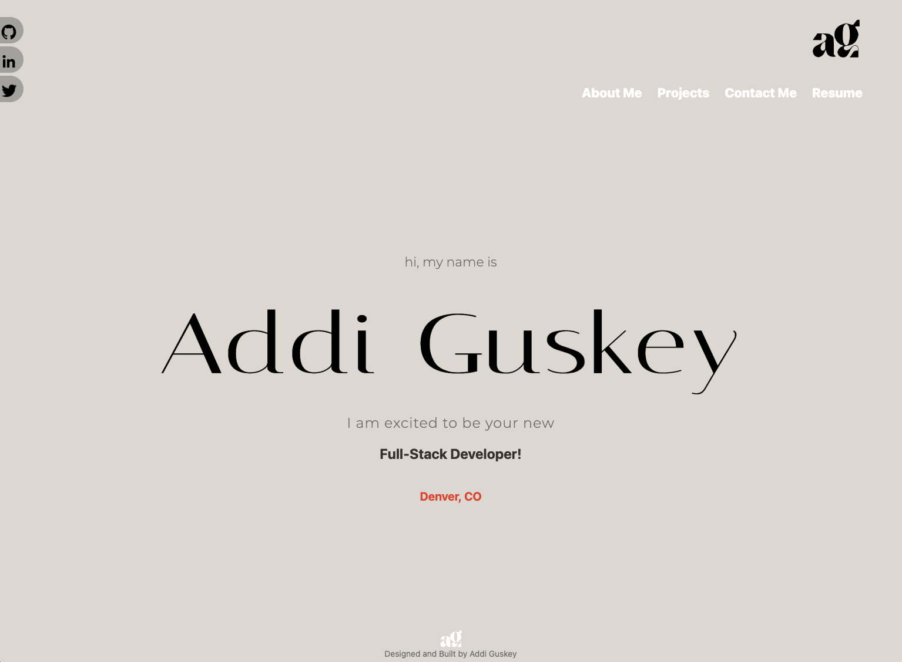

# AddiG Portfolio

# Description

Welcome to my portfolio! <br/>
As a new full-stack coding bootcamp grad, this porfolio is built to showcase my skills with building single-page applications, previous projects, and a little about me.
 
# live link

```
https://addig-portfolio.herokuapp.com/
```

# Table of Contents

- [Built With](#built-with)
- [Installation](#installation)
- [Usage](#usage)
- [Badges](#badges)
- [Questions](#questions)

# Built With

- React.js
- JavaScript

# Installation

1. Clone this SSH Key link on your Terminal (Mac) or gitBash(Windows).

```
git@github.com:addiguskey/this-is-my-portfolio.git
```

2. This app uses React, Emailjs, file-saver and react-bootstrap. You can simply install all dependencies by running "npm i" on your Integrated Terminal in VS-Code

3. Then run "npm start" to open the application on your local device

4. Click [Usage](#usage) for a preview of the application.

# Usage



# Badges


# Questions

For any questions, you can either reach out to me on GitHub or via e-mail

- Username: @addiguskey
- GitHub Link: https://github.com/addiguskey
- E-mail: addisonguskey@gmail.com
